# Análisis detallado de resultados del benchmark IGT — Traducción, glosado y gramática

> **Alcance.** Este documento detalla exclusivamente las dos ejecuciones finales agregadas del benchmark, ambas con el juez adicional `accounts/fireworks/models/kimi-k3`. No se consideran ejecuciones intermedias sin este juez. El análisis se centra en la relación entre **calidad, latencia (velocidad) y costo** por modelo y por tarea. Todas las puntuaciones de calidad se expresan en escala de 1 a 5 asignada por los modelos jueces.

> **Nota sobre visualización de gráficos.** Los gráficos de barras utilizan `xychart-beta` y los diagramas de dispersión utilizan `flowchart` con cuadrantes. Esta combinación garantiza la visualización correcta en **Visual Studio Code** (versión 1.87 o superior) con la vista previa de Markdown y la extensión `bierner.markdown-mermaid` habilitada, o con `markdown.preview.mermaid` activado. Se han sanitizado títulos y etiquetas a ASCII y se han reemplazado los `quadrantChart` originales por `flowchart` equivalentes, ya que `quadrantChart` y `xychart-beta` con caracteres acentuados provocan errores de parseo en varias versiones de VS Code. Si utiliza `mermaid.live` o un navegador actualizado, los mismos datos pueden representarse también como `quadrantChart`/`xychart-beta` sin modificación.

**Ejecuciones analizadas**

| Id. | RunId | Dataset | Casos | Candidatos | Jueces | Costo total |
| --- | --- | --- | ---: | --- | --- | ---: |
| **A** | `20260812121931-b220a6f0` + `addjudge-accounts-fireworks-models-kimi-k3` | `datasets/evaluation/english.jsonl` | 20 | 5 | `deepseek/deepseek-v4-flash-0731:nitro`, `openai/gpt-5.6-luna`, `accounts/fireworks/models/kimi-k3` | **USD 0,346319** |
| **B** | `20260813213251-2c6f7cd1` + `addjudge-dots-studio-dots-3-note-preview-free` + `addcandidate-google-gemini-3.5-flash-lite:nitro` + `addjudge-accounts-fireworks-models-kimi-k3` | `datasets/evaluation/english_red.jsonl` | 8 | 4 | `deepseek/deepseek-v4-flash-0731:nitro`, `openai/gpt-5.6-luna`, `dots-studio/dots-3-note-preview:free`, `accounts/fireworks/models/kimi-k3` | **USD 0,290042** |

*La ejecución B es la agregación final de la segunda evaluación: partió de 3 candidatos y 2 jueces, incorporó el juez `dots-3-note-preview:free` (sin costo) y el candidato `google/gemini-3.5-flash-lite:nitro`, y finalmente el juez `kimi-k3`. La ejecución A es la primera evaluación (corpus completo) agregada con `kimi-k3`.*

---

## 1. Metodología

### 1.1 Corpus y tareas

El benchmark evalúa tres tareas encadenadas sobre inglés → español para fines de *Interlinear Glossed Text (IGT)*:

1.  **Traducción:** traducción natural y fluida al español, preservando significado y contexto.
2.  **Glosado:** segmentación a nivel de token con glosa corta en español (`surface` → `gloss`). Se excluyen signos de puntuación y lecturas fonéticas salvo necesidad.
3.  **Gramática:** identificación de hasta dos puntos gramaticales notables del texto inglés con explicación pedagógica en español (`grammar_point`, `sentence`, `explanation`).

Cada caso del dataset contiene 1 a 3 oraciones. El sistema exige salida JSON estricta por etapa; cualquier desviación de esquema, timeout (> 40 000 ms) o error HTTP se contabiliza como fallo de validación o de transporte.

### 1.2 Modelos candidatos

| Evaluación | Modelo | Proveedor / Ruta |
| --- | --- | --- |
| A y B | `inception/mercury-2` | Inception |
| A y B | `openai/gpt-5.6-luna:nitro` | OpenAI |
| A | `thinkingmachines/inkling-small:nitro` | Thinking Machines |
| A | `arcee-ai/trinity-large-thinking:nitro` | Arcee AI (Parasail) |
| A | `nvidia/nemotron-3.5-lightning:nitro` | NVIDIA |
| B | `google/gemini-3.7-flash:nitro` | Google |
| B | `google/gemini-3.5-flash-lite:nitro` | Google |

Temperatura fijada en `0,2`, `response_format = json_schema`, una repetición por caso.

### 1.3 Modelos jueces

| Juez | Costo | Perfil observado |
| --- | --- | --- |
| `deepseek/deepseek-v4-flash-0731:nitro` | Con costo | Tiende a puntuar alto en traducción, moderado-bajo en glosa. |
| `openai/gpt-5.6-luna` | Con costo | El más estricto en glosa (medias 2,57–3,19 en A; 2,57–3,00 en B). |
| `dots-studio/dots-3-note-preview:free` | **Sin costo** | Solo en B. Sesgo sistemático al alza: 4,79–4,93 en traducción, 3,23–4,09 en glosa, 4,70–5,00 en gramática. Incrementa el desacuerdo medio. |
| `accounts/fireworks/models/kimi-k3` | Con costo (Fireworks) | Criterio intermedio, cercano a la media. Aporta tercera visión independiente en ambas evaluaciones. |

Cada salida válida de cada etapa es evaluada por cada juez (escala 1–5). El informe reporta media, conteo de evaluaciones y desacuerdo medio (diferencia absoluta promedio entre jueces sobre el mismo caso).

### 1.4 Métricas reportadas

*   **Fiabilidad:** `validRate` (salidas con JSON válido) y `transportSuccessRate` (llamadas HTTP 200). Se desagregan `failedCalls`, `timeoutCalls` y códigos HTTP. Las pérdidas de validez y los fallos de transporte son categorías excluyentes: una respuesta HTTP 200 cuyo contenido no supera la validación de esquema resta a `validRate` pero no cuenta como fallo de transporte (véase el desglose de la sección 2.2).
*   **Calidad:** media aritmética de las puntuaciones de todos los jueces sobre salidas válidas; desagregación `byJudge` y `disagreementMean`. Cada juez puntúa además cinco o seis **dimensiones específicas por tarea** (p. ej., `meaning`, `completeness`, `naturalness` en traducción; `surfaceAlignment`, `morphemeGranularity` en glosa), que este documento reporta en las secciones 2.3 y 3.7.
*   **Latencia:** media, mediana y p95 en milisegundos por etapa, medida extremo a extremo.
*   **Costo:** USD exacto (`response_usage`) desagregado en generación del candidato y evaluaciones de jueces. Las llamadas sin información de costo figuran como `unknownCalls` y no se estiman. Las secciones 2.1 y 3.1 presentan el desglose adicional **por etapa** (traducción/glosa/gramática).
*   **Tokens:** `promptTokens`, `completionTokens`, `cachedTokens`.
*   **Diagnóstico cualitativo:** frecuencia de **familias de error** derivadas de los `errorTags` emitidos por los jueces (sección 4.2) y **confianza media** autoinformada por juez (`confidence`, sección 4.3).
*   **Comparación caso a caso:** en la evaluación B (8 casos) se presenta la matriz completa de calidad `overall` por caso y modelo (sección 3.7).

Todas las tablas nuevas de este documento se generan de forma reproducible con `scripts/informe_granular.mjs` a partir de los archivos `report.json`, `usage.jsonl` y `judgements.jsonl` de cada ejecución agregada; los totales fueron verificados contra `grandTotalCost` de cada reporte (coincidencia exacta en ambas evaluaciones).

---

## 2. Evaluación A — Corpus completo `english.jsonl` (20 casos, 5 candidatos, 3 jueces)

> **Contexto:** es la evaluación más amplia en cobertura. Incluye modelos de razonamiento extenso (`inkling-small`, `trinity-large-thinking`, `nemotron-3.5-lightning`) que posteriormente fueron descartados por baja fiabilidad en glosado.

### 2.1 Costo total y distribución

*   **Costo agregado (candidatos + jueces): USD 0,346319** (`975` llamadas, `386` sin costo informado).
*   **Solo jueces: USD 0,156974** (`675` llamadas, `312` sin costo). Representa el **45,3 %** del gasto total.
*   **Costo por candidato (generación + jueces):**

| Modelo | Generación | Jueces | Total | % del total | Llamadas sin costo |
| --- | ---: | ---: | ---: | ---: | ---: |
| `inception/mercury-2` | 0,054022 | 0,043919 | **0,097941** | 28,3 % | 87 |
| `arcee-ai/trinity-large-thinking:nitro` | 0,056387 | 0,034214 | **0,090601** | 26,2 % | 71 |
| `nvidia/nemotron-3.5-lightning:nitro` | 0,045851 | 0,031642 | **0,077493** | 22,4 % | 85 |
| `openai/gpt-5.6-luna:nitro` | 0,017571 | 0,035479 | **0,053049** | 15,3 % | 81 |
| `thinkingmachines/inkling-small:nitro` | 0,015515 | 0,011720 | **0,027235** | 7,9 % | 62 |

**Lectura:** `mercury-2` es el candidato más costoso en términos absolutos, impulsado por su alto consumo de tokens de salida en glosa (41 995 tokens) y gramática. `inkling-small` aparece como el más económico, pero su costo está subestimado porque solo el 25 % de sus salidas llegaron a ser juzgadas (el resto falló por timeout/error). `gpt-5.6-luna` es el más eficiente entre los modelos fiables: genera con pocos tokens (5 978 en traducción) y mantiene costo de jueces moderado pese a su alta tasa de validez.

**Costo exacto por etapa** (fuente: `usage.jsonl`, atribuido al candidato evaluado):

| Modelo | Trad. gen. | Trad. jueces | Trad. total | Glosa gen. | Glosa jueces | Glosa total | Gram. gen. | Gram. jueces | Gram. total |
| --- | ---: | ---: | ---: | ---: | ---: | ---: | ---: | ---: | ---: |
| `trinity-large-thinking` | 0,015119 | 0,012504 | 0,027624 | 0,016633 | 0,002675 | 0,019307 | 0,024635 | 0,019035 | 0,043670 |
| `inception/mercury-2` | 0,007353 | 0,013861 | 0,021215 | 0,035483 | 0,015706 | 0,051189 | 0,011185 | 0,014352 | 0,025537 |
| `thinkingmachines/inkling-small` | 0,008132 | 0,007666 | 0,015798 | — | — | — | 0,007383 | 0,004054 | 0,011437 |
| `openai/gpt-5.6-luna` | 0,002003 | 0,012017 | 0,014020 | 0,012210 | 0,010358 | 0,022568 | 0,003358 | 0,013104 | 0,016462 |
| `nvidia/nemotron-3.5-lightning` | 0,007963 | 0,010843 | 0,018807 | 0,029715 | 0,008049 | 0,037764 | 0,008173 | 0,012750 | 0,020922 |

*`inkling-small` no registra costo en glosa porque no produjo ninguna salida válida que llegara a juzgarse.*

**Lectura del desglose:** la glosa concentra la mayor parte del gasto de generación en `mercury-2` (0,035483, el 65 % de su costo de generación) y `nemotron` (0,029715). El costo de jueces, en cambio, se distribuye de forma bastante uniforme entre etapas para cada modelo, con la excepción de `trinity-large-thinking`, cuyo gasto de jueces en glosa es mínimo (0,002675) precisamente porque casi todas sus glosas fallaron y nunca llegaron a evaluarse.

### 2.2 Fiabilidad por modelo y por tarea

| Modelo | Traducción (válida / transporte) | Glosa | Gramática | Fallos de transporte (timeouts) | Inválidas por esquema |
| --- | --- | --- | --- | --- | ---: |
| `inception/mercury-2` | **100 % / 100 %** | **100 % / 100 %** | **100 % / 100 %** | 0 (0) | 0 |
| `openai/gpt-5.6-luna:nitro` | 95 % / 100 % | 90 % / 100 % | 85 % / 100 % | 0 (0) * | **6** |
| `nvidia/nemotron-3.5-lightning:nitro` | 100 % / 100 % | **70 % / 70 %** | 95 % / 100 % | 6 (6) | 1 |
| `arcee-ai/trinity-large-thinking:nitro` | 95 % / 95 % | **20 % / 20 %** | 100 % / 100 % | 17 (17) | 0 |
| `thinkingmachines/inkling-small:nitro` | 50 % / 50 % | **0 % / 0 %** | 25 % / 25 % | 45 (36) | 0 |

\* `gpt-5.6-luna` no registra ningún fallo de transporte: sus 6 pérdidas de validez son respuestas HTTP 200 cuyo cuerpo llegó vacío o sin estructura utilizable (`en-010` en las tres etapas, más `en-011` y `en-014`), verificadas contra `validations.jsonl`. Las dos últimas columnas son categorías excluyentes: los intentos que nunca completaron (timeout, error HTTP) cuentan como fallos de transporte; los que completaron pero no superaron la validación del esquema JSON, como inválidas por esquema.

**Análisis por tarea:**

*   **Traducción** es la etapa más robusta: todos los modelos superan el 95 % salvo `inkling-small`. Los fallos de `inkling-small` combinan `429` (límite de tasa) y `network` (timeout).
*   **Glosado** es el cuello de botella. Concentra **39 de los 59 timeouts** de la evaluación (66 %) y 42 de los 68 fallos totales (62 %); el resto se reparte entre traducción (8 timeouts) y gramática (12). `inkling-small` no produjo una sola glosa válida; `trinity-large-thinking` solo 4 de 20; `nemotron` 14 de 20. La causa es latencia extrema (medianas ≥ 31 s) que supera el límite de 40 s.
*   **Gramática** recupera fiabilidad salvo en `inkling-small`.

> **Implicación práctica:** cualquier despliegue que incluya glosado debe excluir `inkling-small` y `trinity-large-thinking`. `nemotron` es marginal (70 %).

### 2.3 Calidad por modelo y por tarea (media de 3 jueces, escala 1–5)

| Modelo | Traducción | Glosa | Gramática | Evaluaciones totales (trad / glosa / gram) |
| --- | ---: | ---: | ---: | ---: |
| `openai/gpt-5.6-luna:nitro` | **4,88** | **3,40** | **4,40** | 54 / 30 / 48 |
| `thinkingmachines/inkling-small:nitro` | 4,66 | — | 4,57 | 29 / 0 / 14 |
| `inception/mercury-2` | 4,43 | 3,27 | 3,89 | 56 / 41 / 51 |
| `arcee-ai/trinity-large-thinking:nitro` | 4,40 | 3,25 | 3,75 | 52 / 8 / 56 |
| `nvidia/nemotron-3.5-lightning:nitro` | 4,17 | 2,86 | 3,69 | 50 / 29 / 50 |

**Distancia frente al líder por tarea** (Δ en puntos; el costo total se expresa como múltiplo del más económico):

| Modelo | Δ Trad. | Δ Glosa | Δ Gram. | Δ costo total |
| --- | ---: | ---: | ---: | ---: |
| `gpt-5.6-luna` | líder | líder | −0,18 | ×1,95 |
| `inkling-small` | −0,22 | s/d | líder | líder * |
| `mercury-2` | −0,45 | −0,13 | −0,69 | ×3,60 |
| `trinity-large-thinking` | −0,48 | −0,15 | −0,82 | ×3,33 |
| `nemotron-3.5-lightning` | −0,71 | −0,54 | −0,88 | ×2,85 |

*\* El costo de `inkling-small` está subestimado por sus fallos masivos (ver §2.1); su posición de "líder" en costo no es comparable.*

**Desagregación completa por juez y desacuerdo** (todas las combinaciones modelo × etapa; entre paréntesis, número de evaluaciones por juez):

| Modelo – Etapa | Media global | `deepseek` | `gpt-5.6-luna` (juez) | `kimi-k3` | Desacuerdo medio |
| --- | ---: | ---: | ---: | ---: | ---: |
| `gpt-5.6-luna` – trad. | 4,88 | **5,00** (16) | 4,87 (19) | 4,79 (19) | **0,21** (el más consensuado) |
| `gpt-5.6-luna` – glosa | 3,40 | 3,50 (4) | 3,19 (16) | 3,70 (10) | 0,50 |
| `gpt-5.6-luna` – gram. | 4,40 | 4,29 (14) | 4,41 (17) | 4,47 (17) | 0,41 |
| `inkling-small` – trad. | 4,66 | 4,65 (10) | 4,61 (9) | 4,70 (10) | 0,45 |
| `inkling-small` – gram. | 4,57 | 4,75 (4) | 4,40 (5) | 4,60 (5) | 0,40 |
| `mercury-2` – trad. | 4,43 | 4,64 (18) | 4,24 (19) | 4,42 (19) | 0,47 |
| `mercury-2` – glosa | 3,27 | 3,67 (6) | **2,83** (18) | 3,59 (17) | **0,81** |
| `mercury-2` – gram. | 3,89 | 3,83 (15) | 3,92 (16) | 3,90 (20) | 0,53 |
| `trinity-large-thinking` – trad. | 4,40 | 4,56 (16) | 4,27 (18) | 4,39 (18) | 0,51 |
| `trinity-large-thinking` – glosa | 3,25 | 3,00 (1) | 3,00 (4) | 3,67 (3) | 0,50 |
| `trinity-large-thinking` – gram. | 3,75 | 3,72 (16) | 3,73 (20) | 3,80 (20) | 0,30 |
| `nemotron-3.5-lightning` – trad. | 4,17 | 4,54 (12) | 4,00 (18) | 4,10 (20) | **0,60** (mayor dispersión en trad.) |
| `nemotron-3.5-lightning` – glosa | 2,86 | 3,25 (4) | **2,57** (14) | 3,09 (11) | 0,58 |
| `nemotron-3.5-lightning` – gram. | 3,69 | 3,79 (14) | 3,64 (18) | 3,67 (18) | 0,37 |

*`inkling-small` no tiene fila de glosa porque no generó ninguna salida válida de esa etapa.*

**Lecturas clave:**

1.  **`gpt-5.6-luna` lidera con claridad** en las tres tareas y con el menor desacuerdo en traducción (0,21). Es el único modelo que supera 4,8 en traducción y 3,4 en glosa. Su ventaja es más amplia en traducción (+0,22 sobre el segundo) que en glosa (+0,13), donde las diferencias son menores y el ruido inter-juez es mayor.
2.  **`inkling-small` exhibe medias altas pero no representativas.** Su 4,66 en traducción se basa en solo 10 casos válidos (50 % de pérdida) y su 4,57 en gramática en 5 casos; la ausencia total de glosas impide compararlo.
3.  **Glosa es la tarea con mayor varianza inter-juez.** El juez `gpt-5.6-luna` castiga sistemáticamente (2,57–2,83) mientras `deepseek` y `kimi-k3` son más benevolentes (3,09–3,67). El desacuerdo medio en glosa (0,58–0,81) duplica al de traducción (0,21–0,60) y anticipa lo observado en la evaluación B.
4.  **`nemotron-3.5-lightning` es el más débil** en las tres tareas pese a su costo intermedio, con la traducción más baja (4,17) y la glosa más baja (2,86).

#### Calidad por dimensión del juez (evaluación A)

Los jueces no emiten solo la puntuación global (`overall`): califican cada salida en cinco o seis dimensiones específicas por tarea. La desagregación siguiente promedia todas las evaluaciones válidas de los tres jueces.

**Traducción**

| Modelo | Global | Sentido | Integridad | Naturalidad | Español | Contexto | n |
| --- | ---: | ---: | ---: | ---: | ---: | ---: | ---: |
| `gpt-5.6-luna` | **4,88** | **4,91** | 4,98 | **4,81** | **4,93** | **4,93** | 54 |
| `inkling-small` | 4,66 | 4,76 | **5,00** | 4,41 | 4,67 | 4,79 | 29 |
| `mercury-2` | 4,43 | 4,70 | 4,89 | 4,11 | 4,43 | 4,66 | 56 |
| `trinity-large-thinking` | 4,40 | 4,50 | 4,83 | 4,20 | 4,57 | 4,67 | 52 |
| `nemotron-3.5-lightning` | 4,17 | 4,35 | 4,69 | 3,98 | 4,31 | 4,40 | 50 |

**Glosa**

| Modelo | Global | Alineación | Granularidad morfémica | Exactitud de glosa | Puntuación | Utilidad didáctica | n |
| --- | ---: | ---: | ---: | ---: | ---: | ---: | ---: |
| `gpt-5.6-luna` | **3,40** | 4,37 | **3,73** | **3,43** | 1,77 | **3,30** | 30 |
| `mercury-2` | 3,27 | **4,59** | 3,80 | 3,17 | 2,02 | 3,24 | 41 |
| `trinity-large-thinking` | 3,25 | 4,63 | 3,75 | 3,38 | 1,88 | 3,25 | 8 |
| `nemotron-3.5-lightning` | 2,86 | 4,34 | 3,48 | 2,69 | 1,97 | 2,66 | 29 |

**Gramática**

| Modelo | Global | Presencia | Exactitud | Evidencia | Explicación | Pedagogía | n |
| --- | ---: | ---: | ---: | ---: | ---: | ---: | ---: |
| `inkling-small` | 4,57 | 5,00 | **4,64** | 5,00 | 4,71 | 4,57 | 14 |
| `gpt-5.6-luna` | 4,40 | 5,00 | 4,42 | 4,67 | **4,44** | **4,35** | 48 |
| `mercury-2` | 3,89 | 4,76 | 3,90 | 4,55 | 3,86 | 3,86 | 51 |
| `trinity-large-thinking` | 3,75 | 4,69 | 3,58 | 4,43 | 3,75 | 3,77 | 56 |
| `nemotron-3.5-lightning` | 3,69 | 4,70 | 3,64 | 4,50 | 3,60 | 3,60 | 50 |

**Lectura por dimensiones:** el ordenamiento global de la traducción se explica casi por completo por **naturalidad** (`gpt-5.6-luna` 4,81 vs. `mercury-2` 4,11): las diferencias en sentido e integridad son mínimas para todos los candidatos. En glosa, en cambio, la debilidad transversal está en el **manejo de puntuación** (1,77–2,02 para todos los modelos), mientras que la alineación superficial es alta (4,34–4,63); esto indica que el problema compartido no es la segmentación de tokens sino la representación de signos de puntuación del original. En gramática, `gpt-5.6-luna` lidera exactamente en las dimensiones pedagógicas (explicación y pedagogía), coherente con su perfil didáctico.

### 2.4 Latencia por modelo y por tarea

| Modelo | Traducción (media / mediana / p95) | Glosa | Gramática | Tiempo total medio por caso* |
| --- | --- | --- | --- | --- |
| `inception/mercury-2` | **1 531 / 1 202 / 2 248 ms** | **6 349 / 5 184 / 10 542 ms** | **2 247 / 2 141 / 3 317 ms** | **10,1 s** |
| `openai/gpt-5.6-luna:nitro` | 2 981 / 2 447 / 4 807 ms | 8 912 / 8 464 / 14 287 ms | 3 944 / 3 875 / 5 624 ms | **15,8 s** |
| `nvidia/nemotron-3.5-lightning:nitro` | 5 551 / 4 260 / 11 000 ms | 29 547 / 31 937 / 40 005 ms | 5 898 / 5 226 / 9 190 ms | **41,0 s** |
| `arcee-ai/trinity-large-thinking:nitro` | 7 941 / 5 362 / 13 173 ms | 38 163 / 40 002 / 40 005 ms | 9 794 / 8 701 / 16 129 ms | **55,9 s** |
| `thinkingmachines/inkling-small:nitro` | 22 712 / 21 515 / 40 010 ms | 34 173 / 40 003 / 40 010 ms | 28 946 / 40 003 / 40 010 ms | **85,8 s** |

\* Suma de medias por etapa; no incluye overhead de orquestación.

**Observaciones:**

*   `mercury-2` es el **más veloz en traducción, glosa y gramática**, con latencias estables (p95 < 3,4 s en traducción/gramática). Es el único modelo con glosa < 7 s de media.
*   `gpt-5.6-luna` ofrece latencias moderadas pero sufre en glosa (8,9 s, p95 14,3 s).
*   Los tres modelos de razonamiento extenso superan con frecuencia el timeout en glosa; sus medianas (31–40 s) explican las tasas de fallo.

### 2.5 Tokens y eficiencia

| Modelo | Traducción (entrada / salida / total) | Glosa | Gramática |
| --- | --- | --- | --- |
| `mercury-2` | 12 223 / 7 164 / 19 387 (cache 4 779) | 21 270 / 41 995 / 63 265 (cache 5 913) | 13 378 / 11 960 / 25 338 (cache 5 021) |
| `gpt-5.6-luna` | 3 779 / 2 199 / 5 978 | 9 840 / 16 435 / 26 275 | 3 543 / 4 364 / 7 907 |
| `nemotron-3.5-lightning` | 3 139 / 39 032 / 42 171 | 6 663 / 146 911 / 153 574 | 2 685 / 40 192 / 42 877 |
| `trinity-large-thinking` | 2 838 / 17 324 / 20 162 | 1 726 / 19 398 / 21 124 | 2 585 / 28 545 / 31 130 |
| `inkling-small` | 1 546 / 6 197 / 7 743 | 0 / 0 / 0 | 668 / 5 902 / 6 570 |

`nemotron` genera volúmenes de *completion* desproporcionados en glosa (146 911 tokens) y gramática (40 192), lo que explica su costo y latencia pese a una calidad inferior. `mercury-2` compensa con reutilización de caché (≈ 25 % de tokens de entrada).

### 2.6 Gráficos — Evaluación A

#### 2.6.1 Calidad por tarea — EFECTIVA (penaliza respuestas no válidas)

> **Cambio respecto a versión anterior:** el gráfico previo mostraba la *calidad condicional* (media solo sobre salidas válidas, `resultados_detalle.md:57` y `§2.3`). Ese cálculo no penaliza fallos y produce el artefacto que señalas: `inkling-small` quedaba 2.º en traducción (4,66) y 1.º en gramática (4,57) porque promediaba solo 10/20 y 5/20 casos válidos (0/20 en glosa, `§2.2`). **Este gráfico lo reemplaza por la calidad efectiva**, que sí toma en cuenta las respuestas no válidas.

**Definición:** `Calidad efectiva = media_condicional × validRate` (fallo = 0). Es la calidad esperada por caso si un fallo aporta 0 puntos. Con el criterio conservador dentro de escala (fallo = 1, mínimo 1–5) la fórmula es `1 + (media-1) × validRate`; el orden no cambia, solo se comprime la penalización.

| Modelo | Trad. cond. → efectiva (0) / (1) | Glosa cond. → efectiva (0) / (1) | Gram. cond. → efectiva (0) / (1) | validRate trad / glosa / gram |
| --- | --- | --- | --- | --- |
| `gpt-5.6-luna` | 4,88 → **4,64** / 4,69 | 3,40 → **3,06** / 3,16 | 4,40 → **3,74** / 3,89 | 95% / 90% / 85% |
| `mercury-2` | 4,43 → **4,43** / 4,43 | 3,27 → **3,27** / 3,27 | 3,89 → **3,89** / 3,89 | 100% / 100% / 100% |
| `trinity-large` | 4,40 → **4,18** / 4,23 | 3,25 → **0,65** / 1,45 | 3,75 → **3,75** / 3,75 | 95% / 20% / 100% |
| `nemotron-3.5` | 4,17 → **4,17** / 4,17 | 2,86 → **2,00** / 2,30 | 3,69 → **3,51** / 3,56 | 100% / 70% / 95% |
| `inkling-small` | 4,66 → **2,33** / 2,83 | — → **0,00** / 1,00 | 4,57 → **1,14** / 1,89 | 50% / 0% / 25% |

*Con fallo = 0 `inkling-small` pasa de 2.º a último en las tres tareas, como intuías. Con fallo = 1 (dentro de escala 1–5) también queda último (2,83 / 1,00 / 1,89).*

> **Nota de renderizado:** `xychart-beta` con 3 series superpone barras en el mismo `x` en `VS Code` (`bierner.markdown-mermaid` ≤10.9) y solo deja 2 colores visibles (la serie del medio queda tapada). Para evitarlo se separan en 3 gráficos monoserie —cada uno renderiza un único color y no hay solapamiento—.

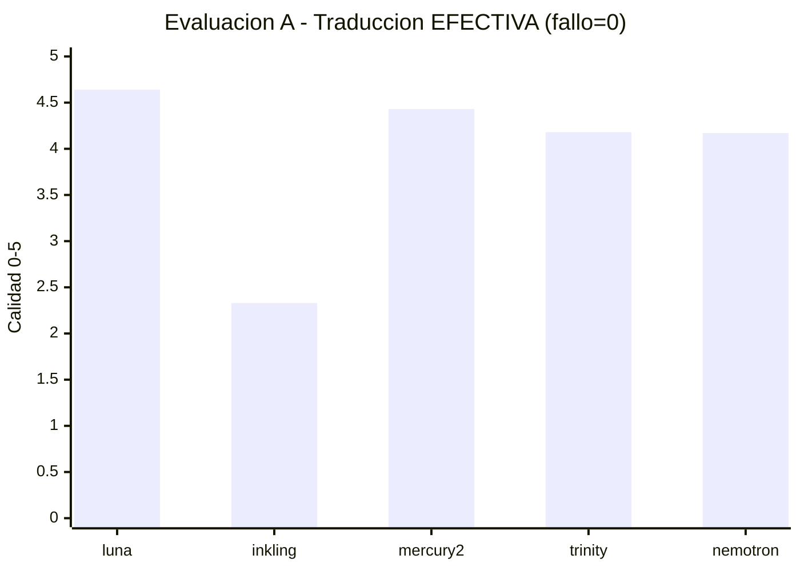

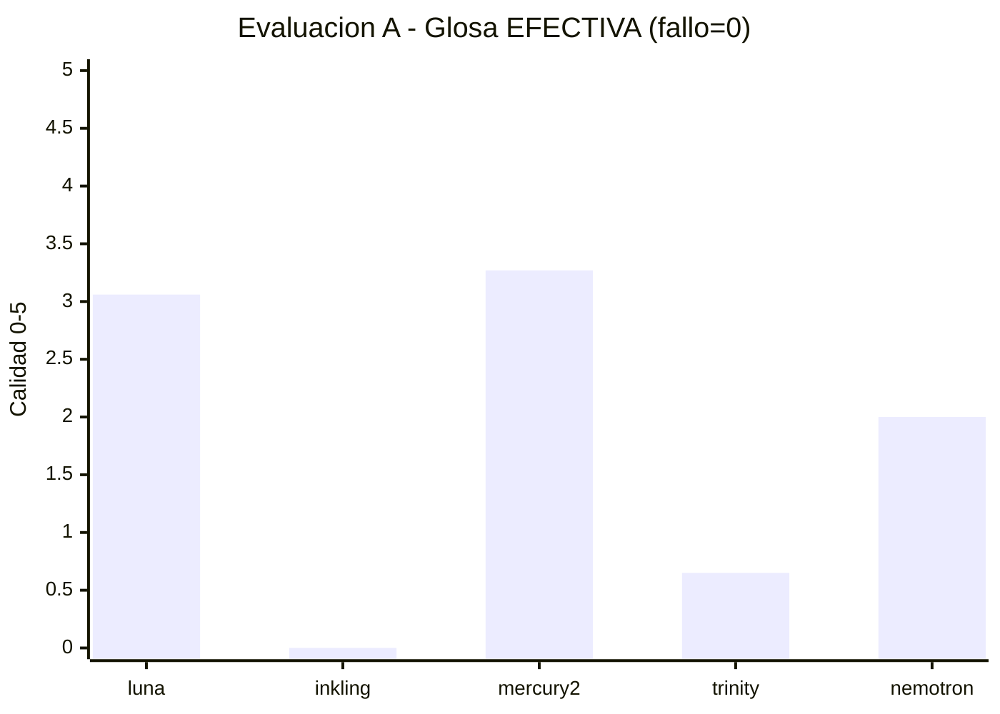

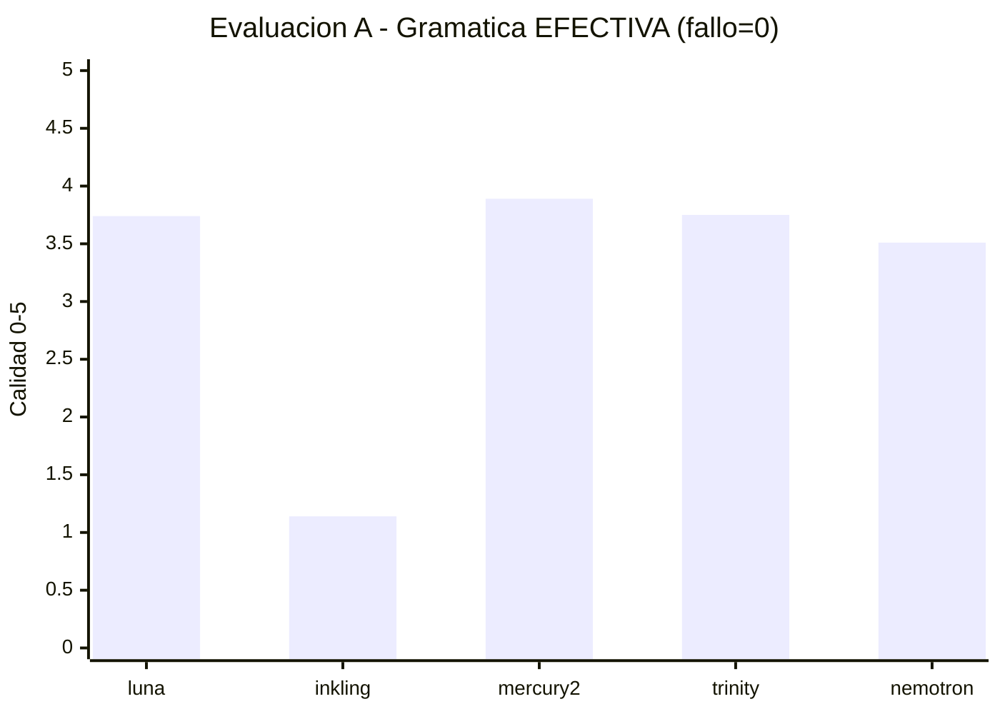

> *Cada gráfico usa un único color (una serie = un color), por lo que no hay solapamiento. Valores = `media_condicional × validRate` (fallo = 0). Fuente medias: `§2.3`; fuente validRate: `§2.2` y `results/20260812121931-b220a6f0-addjudge-accounts-fireworks-models-kimi-k3/report.json` (`reliability.validRate`). El gráfico anterior de 3 series superpuestas se retira por bug de renderizado; histórico condicional sin penalizar: `[4.88,4.66,4.43,4.40,4.17] / [3.40,0,3.27,3.25,2.86] / [4.40,4.57,3.89,3.75,3.69]` con eje 2,5–5 que ocultaba el 0 de `inkling` en glosa.*

**Latencia media por etapa en ms — Evaluación A** *(separado en 3 gráficos monoserie para evitar solapamiento de `xychart-beta`)*

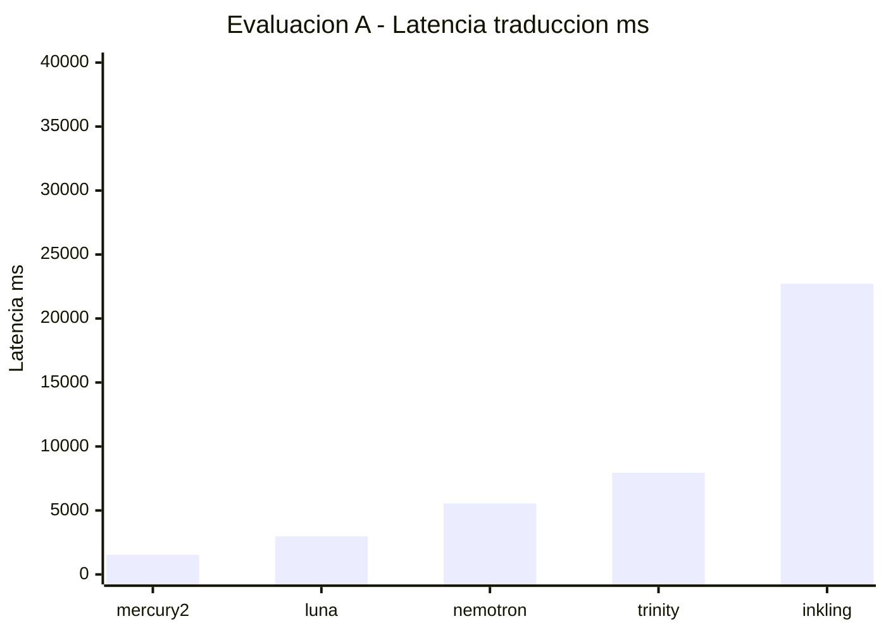

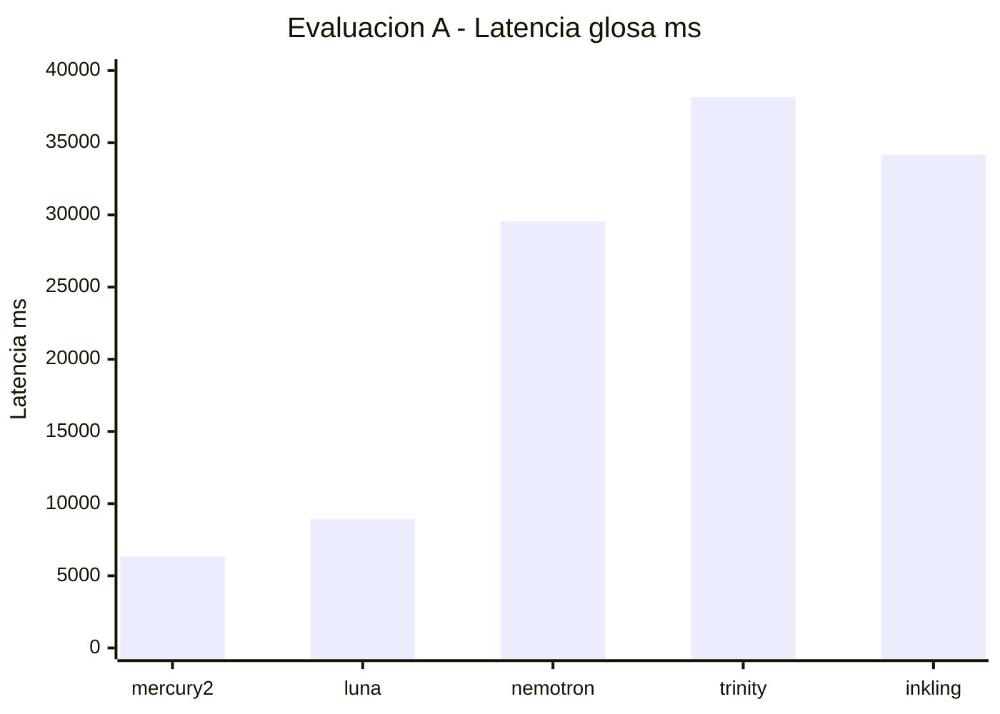

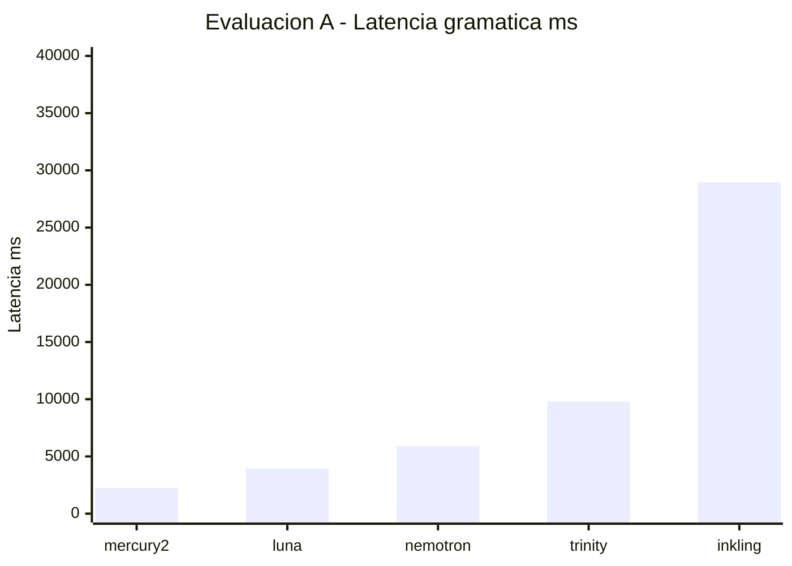

> *Leyenda de series: la primera serie es traducción (1 531–22 712 ms), la segunda glosa (6 349–34 173 ms) y la tercera gramática (2 247–28 946 ms), sobre los mismos cinco modelos del eje X; azul, naranja y verde en el tema por defecto de VS Code. Valores exactos en la tabla de latencia de la sección 2.4.*

## 3. Evaluación B — Corpus reducido `english_red.jsonl` (8 casos, 4 candidatos, 4 jueces)

> **Contexto:** es la evaluación de referencia para decisiones de producto. Trabaja con 8 casos representativos del corpus en inglés, descartando los tres modelos poco fiables de la evaluación A y añadiendo `google/gemini-3.7-flash:nitro` y `google/gemini-3.5-flash-lite:nitro`. Los cuatro candidatos alcanzan **100 % de validez y 100 % de éxito de transporte en las tres etapas**, por lo que las comparaciones de calidad, latencia y costo son plenamente comparables. Los cuatro jueces evalúan cada salida válida; el juez gratuito `dots-3-note-preview:free` aporta volumen sin costo.

### 3.1 Costo total y distribución

*   **Costo agregado: USD 0,290042** (`609` llamadas, `140` sin costo informado).
*   **Solo jueces: USD 0,148077** (`513` llamadas, `140` sin costo) — **51,1 %** del total. El peso de los jueces crece respecto a A porque el corpus es menor pero se evalúan 4 jueces en lugar de 3.
*   **Costo por candidato:**

| Modelo | Generación | Jueces | Total | % del total | Costo por caso | Llamadas sin costo |
| --- | ---: | ---: | ---: | ---: | ---: | ---: |
| `google/gemini-3.7-flash:nitro` | 0,080451 | 0,034509 | **0,114960** | 39,6 % | 0,014370 | 40 |
| `google/gemini-3.5-flash-lite:nitro` | 0,027661 | 0,041164 | **0,068825** | 23,7 % | 0,008603 | 33 |
| `inception/mercury-2` | 0,025900 | 0,039146 | **0,065046** | 22,4 % | 0,008131 | 33 |
| `openai/gpt-5.6-luna:nitro` | 0,007953 | 0,033258 | **0,041212** | 14,2 % | 0,005151 | 34 |

**Lectura detallada:**

*   **`gemini-3.7-flash` es el más costoso con diferencia** (+77 % sobre el segundo). Su costo de generación (0,080451) triplica al de `mercury-2` y decuplica al de `gpt-5.6-luna`, reflejando un alto consumo de tokens de salida en glosa (8 818) y gramática (6 868) sin reutilización de caché.
*   **`gpt-5.6-luna` es el más económico**, tanto en generación (0,007953) como en total. Genera con pocos tokens (1 204 en traducción, 2 048 en gramática) y mantiene el menor costo de jueces porque sus salidas, aunque evaluadas por 4 jueces, requieren menos tokens de evaluación.
*   **`mercury-2` y `gemini-3.5-flash-lite` tienen costo total casi idéntico** (0,065 vs 0,068), pero con composición distinta: `mercury-2` gasta más en generación y menos en jueces; `flash-lite` invierte la relación.
*   **Costo exacto por etapa** (fuente: `usage.jsonl`, atribuido al candidato evaluado):

| Modelo | Trad. gen. | Trad. jueces | Trad. total | Glosa gen. | Glosa jueces | Glosa total | Gram. gen. | Gram. jueces | Gram. total |
| --- | ---: | ---: | ---: | ---: | ---: | ---: | ---: | ---: | ---: |
| `openai/gpt-5.6-luna` | 0,000898 | 0,008416 | 0,009314 | 0,005646 | 0,013334 | 0,018981 | 0,001409 | 0,011508 | 0,012917 |
| `inception/mercury-2` | 0,003458 | 0,008494 | 0,011952 | 0,017782 | 0,018692 | 0,036474 | 0,004660 | 0,011960 | 0,016620 |
| `google/gemini-3.7-flash` | 0,017916 | 0,006958 | 0,024874 | 0,035918 | 0,014846 | 0,050765 | 0,026617 | 0,012705 | 0,039322 |
| `google/gemini-3.5-flash-lite` | 0,002461 | 0,008920 | 0,011380 | 0,022383 | 0,020200 | 0,042583 | 0,002817 | 0,012044 | 0,014861 |

*   **Lectura del desglose:** la etapa de glosa es la más cara para los cuatro candidatos, tanto en generación como en evaluación por jueces. La ventaja de costo de `gemini-3.7-flash` en traducción se revierte en glosa y gramática: su generación cuesta ahí 2–5 veces más que la de sus rivales (0,035918 y 0,026617). El gasto en jueces es casi idéntico entre modelos en gramática (~0,0115–0,0127) porque las salidas de esa etapa tienen longitudes similares; en cambio, evaluar las glosas de `mercury-2` y `flash-lite` cuesta más que evaluar las de `gemini-3.7-flash`, coherente con sus mayores volúmenes de tokens de glosa.

### 3.2 Fiabilidad

| Modelo | Traducción | Glosa | Gramática |
| --- | --- | --- | --- |
| `inception/mercury-2` | 100 % / 100 % | 100 % / 100 % | 100 % / 100 % |
| `openai/gpt-5.6-luna:nitro` | 100 % / 100 % | 100 % / 100 % | 100 % / 100 % |
| `google/gemini-3.7-flash:nitro` | 100 % / 100 % | 100 % / 100 % | 100 % / 100 % |
| `google/gemini-3.5-flash-lite:nitro` | 100 % / 100 % | 100 % / 100 % | 100 % / 100 % |

*Sin fallos de transporte ni salidas inválidas por esquema en toda la evaluación. La fiabilidad deja de ser factor discriminante; la decisión recae íntegramente en calidad, latencia y costo.*

### 3.3 Calidad por modelo y por tarea (media de 4 jueces, escala 1–5)

| Modelo | Traducción | Glosa | Gramática | Promedio simple 3 tareas |
| --- | ---: | ---: | ---: | ---: |
| `google/gemini-3.7-flash:nitro` | **4,85** | 3,59 | **4,76** | **4,40** |
| `openai/gpt-5.6-luna:nitro` | 4,83 | **3,63** | 4,60 | 4,35 |
| `inception/mercury-2` | 4,63 | 3,44 | 4,41 | 4,16 |
| `google/gemini-3.5-flash-lite:nitro` | 4,54 | 2,94 | 3,95 | 3,81 |

*Conteo de evaluaciones: traducción 29–46, glosa 23–38, gramática 31–46 por modelo. Todas las medias se calculan solo sobre salidas válidas (100 % en esta evaluación).*

**Distancia frente al líder por tarea** (Δ en puntos; el costo total se expresa como múltiplo del más económico):

| Modelo | Δ Trad. | Δ Glosa | Δ Gram. | Δ costo total |
| --- | ---: | ---: | ---: | ---: |
| `gemini-3.7-flash` | líder | −0,05 | líder | ×2,79 |
| `gpt-5.6-luna` | −0,02 | líder | −0,16 | líder |
| `mercury-2` | −0,22 | −0,19 | −0,34 | ×1,58 |
| `gemini-3.5-flash-lite` | −0,31 | −0,69 | −0,81 | ×1,67 |

**Desagregación por juez y desacuerdo** (entre paréntesis, número de evaluaciones que cada juez emitió para esa combinación modelo–etapa; "casos comparados" indica sobre cuántos casos distintos se calculó la media):

| Modelo – Etapa | Media | `deepseek` | `luna` (juez) | `dots-3-note` | `kimi-k3` | Desacuerdo medio | Casos comparados |
| --- | ---: | ---: | ---: | ---: | ---: | ---: | ---: |
| `mercury-2` – trad. | 4,63 | 4,69 (8) | 4,31 (8) | **4,79** (22) | 4,43 (7) | 0,59 | 8 |
| `mercury-2` – glosa | 3,44 | 2,49 (7) | 2,69 (8) | **4,09** (19) | 3,50 (4) | **1,89** | 8 |
| `mercury-2` – gram. | 4,41 | 4,24 (8) | 4,00 (8) | **4,70** (23) | 4,14 (7) | 0,94 | 8 |
| `gpt-5.6-luna` – trad. | 4,83 | 4,75 (6) | 4,75 (8) | **4,93** (18) | 4,75 (8) | **0,40** | 8 |
| `gpt-5.6-luna` – glosa | 3,63 | 3,20 (4) | 2,88 (8) | **3,98** (18) | 4,00 (4) | 1,20 | 8 |
| `gpt-5.6-luna` – gram. | 4,60 | 4,71 (7) | 4,13 (8) | **4,92** (18) | 4,25 (8) | 1,00 | 8 |
| `gemini-3.7-flash` – trad. | 4,85 | **5,00** (6) | 4,75 (8) | 4,84 (24) | 4,88 (8) | 0,44 | 8 |
| `gemini-3.7-flash` – glosa | 3,59 | 3,20 (5) | 3,00 (8) | **3,93** (16) | 3,80 (5) | 1,66 | 8 |
| `gemini-3.7-flash` – gram. | 4,76 | 4,75 (8) | 4,25 (8) | **5,00** (21) | 4,63 (8) | 0,88 | 8 |
| `gemini-3.5-flash-lite` – trad. | 4,54 | 4,40 (5) | 4,50 (8) | **4,84** (8) | 4,38 (8) | 0,53 | 8 |
| `gemini-3.5-flash-lite` – glosa | 2,94 | 3,00 (5) | 2,57 (7) | **3,23** (7) | 3,00 (4) | 0,85 | 8 |
| `gemini-3.5-flash-lite` – gram. | 3,95 | 3,43 (7) | 3,81 (8) | **4,73** (8) | 3,75 (8) | **1,50** | 8 |

**Hallazgos por tarea:**

#### Traducción

*   **Ranking:** `gemini-3.7-flash` (4,85) ≈ `gpt-5.6-luna` (4,83) > `mercury-2` (4,63) > `flash-lite` (4,54). La diferencia entre los dos primeros es **0,02 puntos**, estadísticamente irrelevante con 8 casos; ambos superan el umbral de excelencia (≥ 4,8).
*   **Perfil de jueces:** `dots-3-note` puntúa sistemáticamente más alto (4,79–4,93) y eleva las medias respecto a la evaluación de 2 jueces (ver `resultados_resumen.md` §4). `kimi-k3` y `deepseek` convergen en 4,75 para `gpt-5.6-luna`, lo que refuerza la robustez de su puntuación. El desacuerdo medio más bajo es para `gpt-5.6-luna` (0,40), indicando consenso.

#### Glosa

*   **Ranking:** `gpt-5.6-luna` (3,63) > `gemini-3.7-flash` (3,59) > `mercury-2` (3,44) ≫ `flash-lite` (2,94). La brecha entre `flash-lite` y el tercero es **0,50 puntos**, la mayor entre tareas.
*   **Es la tarea más difícil y ruidosa.** Las medias absolutas son bajas (2,94–3,63) frente a traducción (4,54–4,85). El desacuerdo medio es el más alto del benchmark: 1,89 para `mercury-2`, 1,66 para `gemini-3.7-flash`. `dots-3-note` asigna 3,93–4,09 mientras `deepseek`/`luna` asignan 2,49–3,20 sobre las mismas salidas, evidenciando criterios divergentes (granularidad morfémica vs. aceptabilidad pedagógica).
*   **`flash-lite` es el único modelo por debajo de 3,0.** Sus glosas tienden a sobresimplificar tokens complejos (`would` → `condicional`, `morrow` → `día-siguiente`) sin capturar el contexto sintáctico que los jueces más estrictos penalizan.

#### Gramática

*   **Ranking:** `gemini-3.7-flash` (**4,76**) > `gpt-5.6-luna` (4,60) > `mercury-2` (4,41) > `flash-lite` (3,95). Aquí la ventaja de `gemini-3.7-flash` sí es nítida (+0,16 sobre `gpt-5.6-luna`).
*   **`gemini-3.7-flash` logra la puntuación más alta de todo el benchmark** (4,76), impulsada por un 5,00 perfecto del juez `dots-3-note` (21 evaluaciones) y 4,75 de `deepseek`. El juez `gpt-5.6-luna` lo penaliza a 4,25, pero incluso así supera a `mercury-2` (4,00) y `flash-lite` (3,81) según el mismo juez.
*   **`flash-lite` vuelve a quedar descolgado** (3,95), con desacuerdo máximo (1,50) concentrado en gramática: `dots-3-note` le otorga 4,73 mientras `deepseek` solo 3,43.

**Promedio ponderado:** si se promedian las tres tareas con igual peso, `gemini-3.7-flash` (4,40) supera a `gpt-5.6-luna` (4,35) por 0,05; `mercury-2` (4,16) y `flash-lite` (3,81) quedan a distancia. La elección entre los dos primeros depende del peso que se asigne a gramática (ventaja `gemini-3.7`) vs. glosa (ventaja `gpt-5.6`).

### 3.4 Latencia por modelo y por tarea

| Modelo | Traducción (media / mediana / p95) | Glosa | Gramática | Total medio por caso |
| --- | --- | --- | --- | --- |
| `google/gemini-3.5-flash-lite:nitro` | **1 300 / 1 221 / 2 040 ms** | **3 827 / 3 883 / 4 656 ms** | **1 809 / 1 720 / 2 368 ms** | **6,9 s** |
| `inception/mercury-2` | 1 583 / 1 530 / 2 246 ms | 5 803 / 5 452 / 9 927 ms | 2 490 / 2 860 / 3 680 ms | **9,9 s** |
| `openai/gpt-5.6-luna:nitro` | 2 463 / 2 260 / 3 580 ms | 8 594 / 8 581 / 14 951 ms | 3 978 / 3 782 / 5 188 ms | **15,0 s** |
| `google/gemini-3.7-flash:nitro` | 2 599 / 2 544 / 3 374 ms | 3 857 / 3 604 / 5 321 ms | 3 566 / 3 498 / 4 397 ms | **10,0 s** |

**Lectura por tarea:**

*   **Traducción:** `flash-lite` es el más rápido (1,3 s), seguido de cerca por `mercury-2` (1,58 s). Ambos duplican en velocidad a `gpt-5.6-luna` y `gemini-3.7-flash` (≈ 2,5 s). La mediana confirma estabilidad; el p95 de `flash-lite` (2,04 s) es inferior a la media de `gpt-5.6-luna`.
*   **Glosado:** `flash-lite` (3,83 s) y `gemini-3.7-flash` (3,86 s) comparten el liderazgo con latencias virtualmente idénticas y p95 < 5,4 s. `mercury-2` es un 50 % más lento (5,80 s, p95 9,9 s) y `gpt-5.6-luna` duplica el tiempo (8,59 s, p95 15,0 s). Esta es la **única tarea donde `gemini-3.7-flash` no penaliza en velocidad**.
*   **Gramática:** `flash-lite` domina con holgura (1,81 s, p95 2,37 s), **45 % más rápido que `mercury-2`** y **49 % que `gemini-3.7-flash`**. `gpt-5.6-luna` es el más lento (3,98 s).

**Velocidad agregada:** `flash-lite` completa un caso completo en **6,9 s** de media, frente a 9,9–10,0 s de `mercury-2`/`gemini-3.7-flash` y 15,0 s de `gpt-5.6-luna`. Es **2,2 veces más rápido que `gpt-5.6-luna`** en el flujo completo.

### 3.5 Tokens y eficiencia

| Modelo | Traducción (entrada / salida / total) | Glosa | Gramática |
| --- | --- | --- | --- |
| `mercury-2` | 4 072 / 3 612 / 7 684 (cache 1 196) | 7 902 / 21 657 / 29 559 (cache 1 939) | 5 093 / 4 991 / 10 084 (cache 1 586) |
| `gpt-5.6-luna` | 1 756 / 1 204 / 2 960 | 4 532 / 8 655 / 13 187 | 1 805 / 2 048 / 3 853 |
| `gemini-3.7-flash` | 1 353 / 4 507 / 5 860 | 3 801 / 8 818 / 12 619 | 1 149 / 6 868 / 8 017 |
| `gemini-3.5-flash-lite` | 1 353 / 822 / 2 175 | 3 801 / 8 497 / 12 298 | 1 149 / 989 / 2 138 |

*   `mercury-2` consume más tokens de entrada por caso (por prompts más verbosos) pero amortiza con caché (19–31 % de `promptTokens` servidos desde caché).
*   `flash-lite` es el más frugal en traducción y gramática (2 175 y 2 138 tokens totales), lo que explica su bajo costo de generación. En glosa, su consumo se equipara a `gemini-3.7-flash`.
*   `gpt-5.6-luna` mantiene el perfil más equilibrado: genera poco en traducción/gramática y modera en glosa.

### 3.6 Gráficos — Evaluación B

#### 3.6.1 Calidad por tarea (visión comparativa) — separado para evitar solapamiento

> `xychart-beta` con 3 series superpone barras en `VS Code`; se separan en 3 gráficos monoserie.

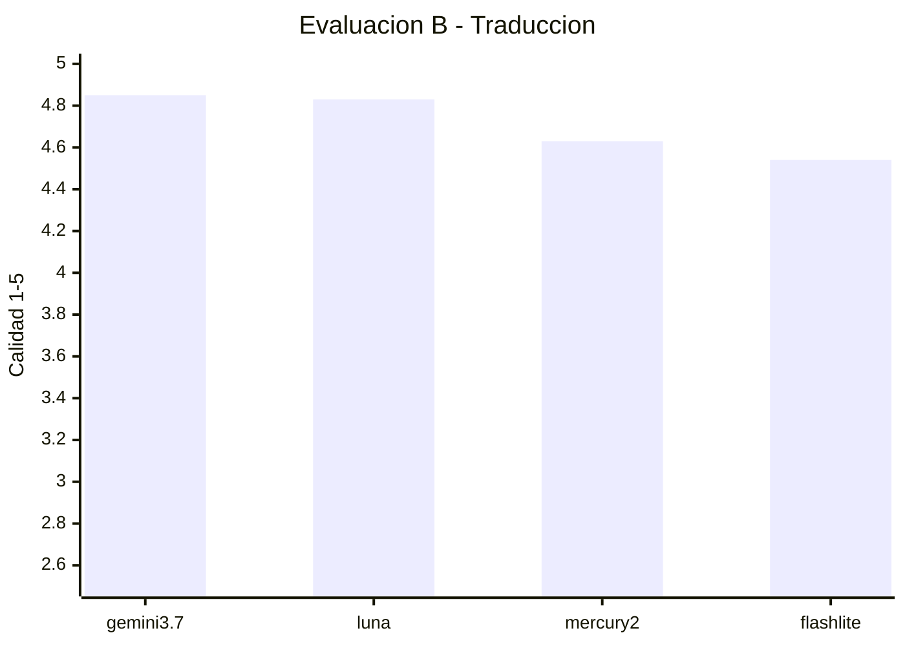

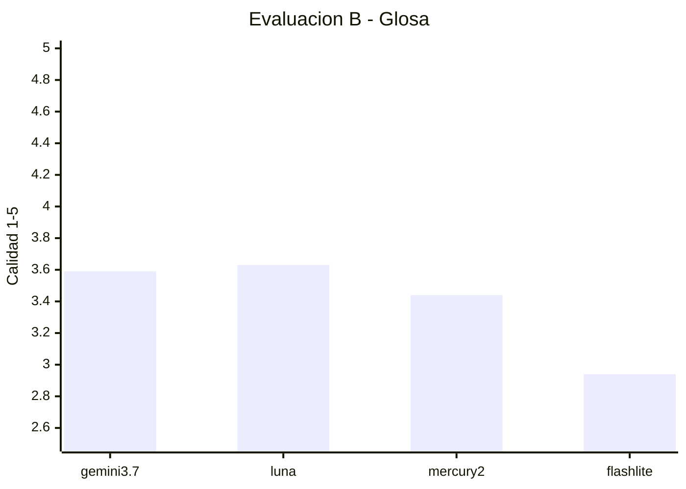

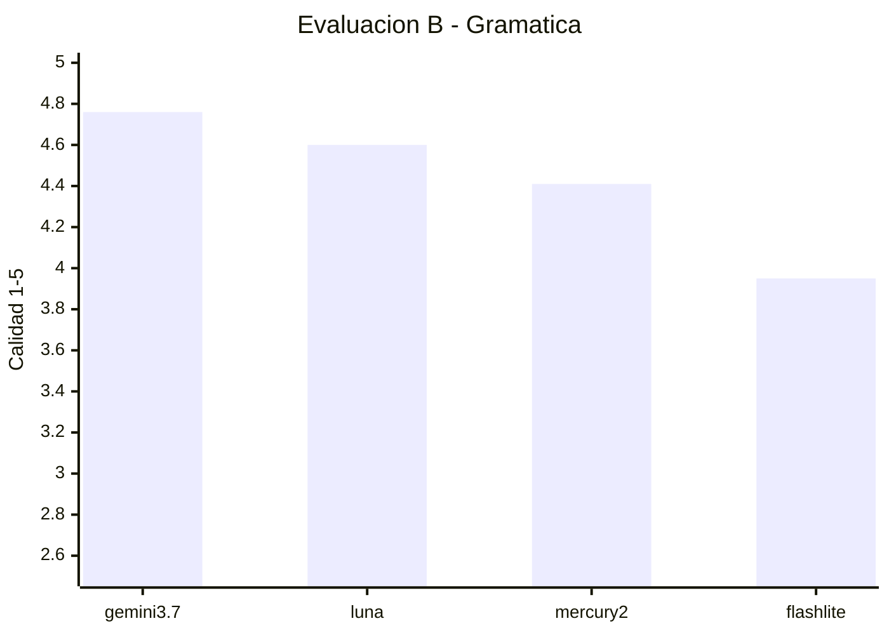

> Cada gráfico muestra una tarea con un único color; la altura confirma que glosa es sistemáticamente la tarea con menor puntuación y mayor brecha entre `flash-lite` y el resto. En B `validRate 100%` en las tres etapas (`§3.2`), por lo que no se requiere corrección efectiva como en A.

**Latencia media por etapa en ms — Evaluación B** *(separado en 3 gráficos monoserie)*

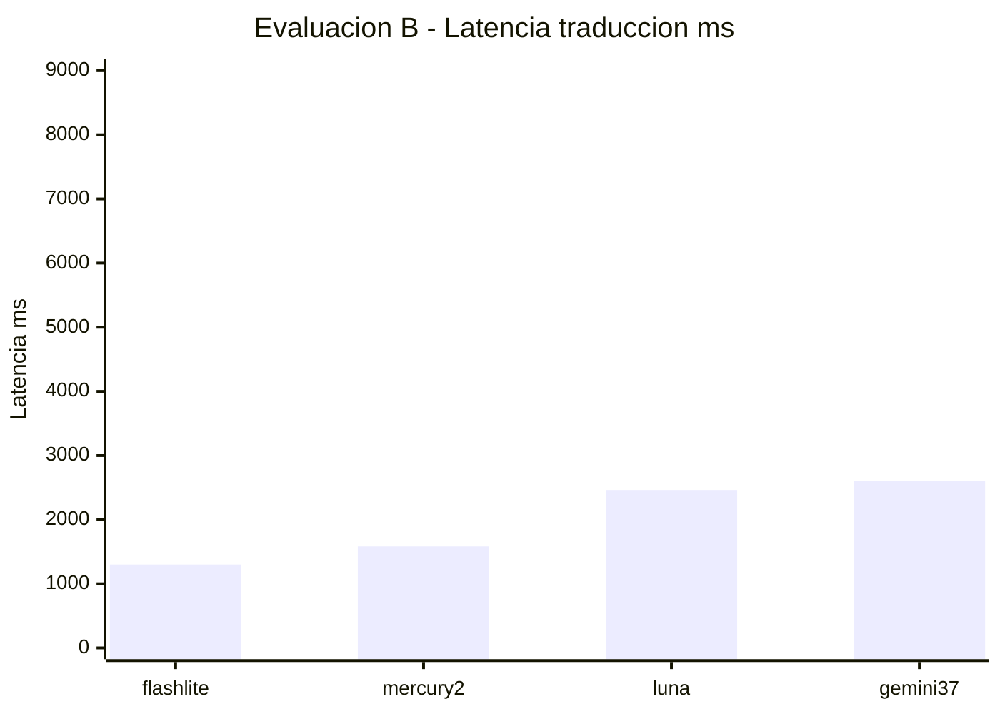

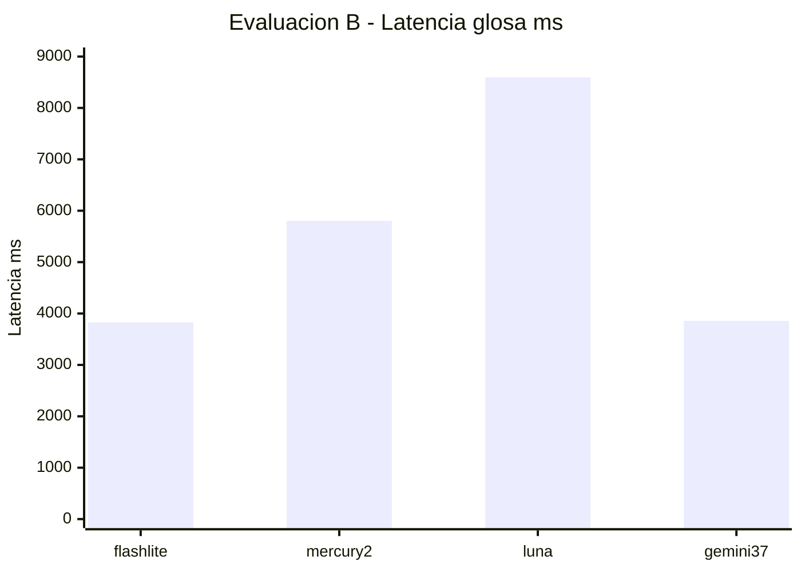

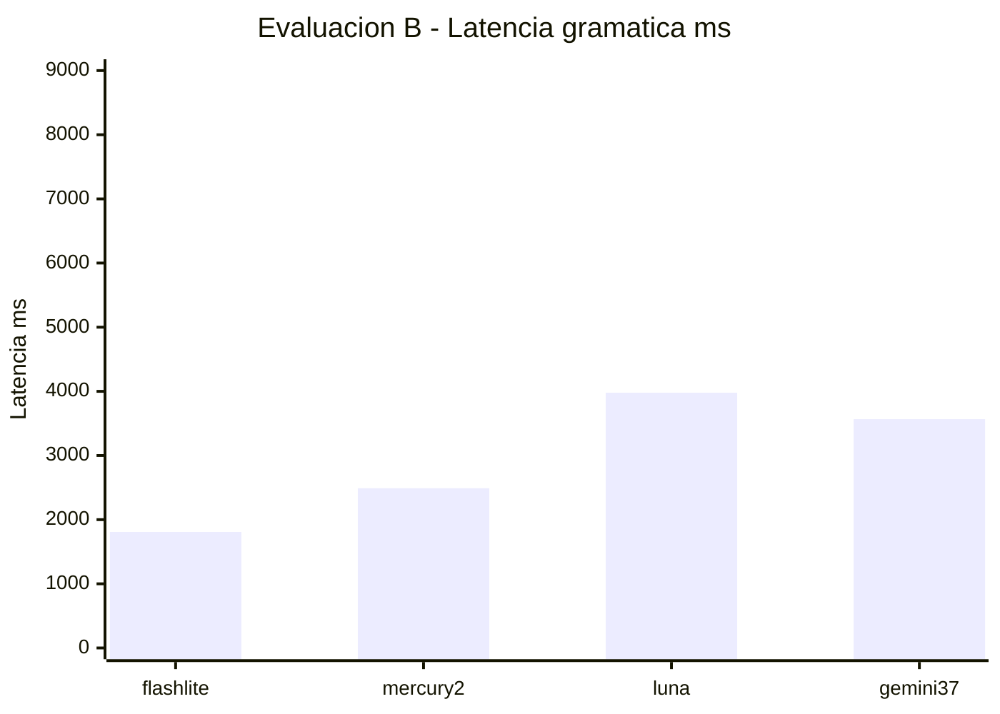

> *Mismo criterio de series: traducción (1 300–2 599 ms), glosa (3 827–8 594 ms) y gramática (1 809–3 978 ms) por modelo; azul, naranja y verde en el tema por defecto. Valores exactos en la tabla de latencia de la sección 3.4.*

**Costo total por modelo en USD — Evaluación B**

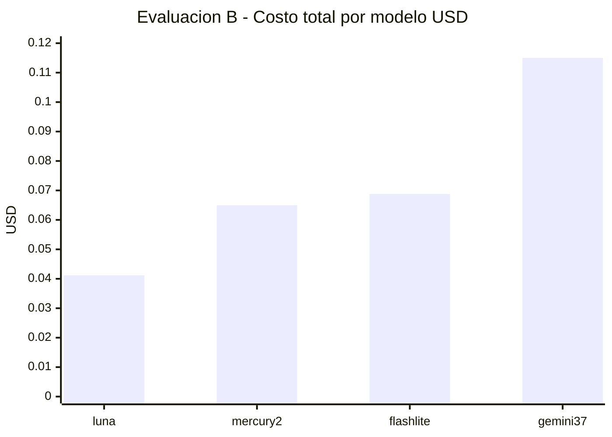

> *Serie única: costo total por candidato (generación + jueces), en el orden `gpt-5.6-luna`, `mercury-2`, `gemini-3.5-flash-lite`, `gemini-3.7-flash`. Valores exactos en la tabla de costo por candidato de la sección 3.1.*

### 3.7 Granularidad adicional: dimensiones del juez y comparación caso a caso

#### Calidad por dimensión del juez

Cada juez califica cinco o seis dimensiones específicas además del puntaje global (`overall`). Las tablas promedian todas las evaluaciones válidas de los cuatro jueces.

**Traducción**

| Modelo | Global | Sentido | Integridad | Naturalidad | Español | Contexto | n |
| --- | ---: | ---: | ---: | ---: | ---: | ---: | ---: |
| `gemini-3.7-flash` | **4,85** | **4,87** | 4,87 | **4,80** | 4,72 | 4,78 | 46 |
| `gpt-5.6-luna` | 4,83 | 4,83 | **4,90** | 4,78 | **4,85** | **4,90** | 40 |
| `mercury-2` | 4,63 | 4,69 | 4,87 | 4,40 | 4,53 | 4,73 | 45 |
| `gemini-3.5-flash-lite` | 4,54 | 4,66 | 4,90 | 4,38 | 4,52 | 4,69 | 29 |

**Glosa**

| Modelo | Global | Alineación | Granularidad morfémica | Exactitud de glosa | Puntuación | Utilidad didáctica | n |
| --- | ---: | ---: | ---: | ---: | ---: | ---: | ---: |
| `gpt-5.6-luna` | **3,63** | 4,29 | **3,94** | **3,74** | 2,32 | **3,74** | 34 |
| `gemini-3.7-flash` | 3,59 | 4,09 | 3,88 | 3,74 | **2,47** | 3,65 | 34 |
| `mercury-2` | 3,44 | **4,39** | 3,68 | 3,46 | 2,34 | 3,58 | 38 |
| `gemini-3.5-flash-lite` | 2,94 | 3,52 | 3,43 | 3,03 | 1,96 | 2,85 | 23 |

**Gramática**

| Modelo | Global | Presencia | Exactitud | Evidencia | Explicación | Pedagogía | n |
| --- | ---: | ---: | ---: | ---: | ---: | ---: | ---: |
| `gemini-3.7-flash` | **4,76** | **4,98** | **4,78** | **4,96** | **4,80** | **4,69** | 45 |
| `gpt-5.6-luna` | 4,60 | 4,95 | 4,65 | 4,88 | 4,65 | 4,61 | 41 |
| `mercury-2` | 4,41 | 4,76 | 4,26 | 4,77 | 4,27 | 4,31 | 46 |
| `gemini-3.5-flash-lite` | 3,95 | 4,45 | 4,02 | 4,26 | 4,03 | 3,94 | 31 |

**Lectura por dimensiones:**

*   En traducción, todos los modelos detectan el sentido y no omiten contenido (integridad 4,66–4,90); la diferencia real está en la **naturalidad** (4,80 de `gemini-3.7-flash` vs. 4,38 de `flash-lite`, una brecha de 0,42 frente a solo 0,21 en sentido). Curiosamente, `gpt-5.6-luna` supera a `gemini-3.7-flash` en español correcto (4,85 vs. 4,72).
*   En glosa, la dimensión **manejo de puntuación** es catastrófica para todos (1,96–2,47) y explica gran parte de las medias globales bajas; la **alineación superficie–glosa** es lo que realmente separa a `flash-lite` (3,52) del resto (4,09–4,39). Su debilidad es estructural, no de vocabulario.
*   En gramática, los dos líderes alcanzan presencia casi perfecta (4,95–4,98); la brecha se abre en **exactitud** (4,78 vs. 4,02 entre `gemini-3.7-flash` y `flash-lite`) y en calidad pedagógica de la explicación.

#### Calidad `overall` caso a caso (8 casos)

Media de los 4 jueces por caso y modelo; en negrita, el máximo de cada fila (los empates comparten crédito).

**Traducción**

| Caso | mercury-2 | gpt-5.6-luna | gemini-3.7-flash | flash-lite | Máx. |
| --- | ---: | ---: | ---: | ---: | ---: |
| `en-001` | 4,80 | 4,58 | **4,83** | 4,25 | 4,83 |
| `en-002` | 4,83 | **5,00** | **5,00** | 4,67 | 5,00 |
| `en-003` | 4,58 | **5,00** | **5,00** | 4,19 | 5,00 |
| `en-004` | **5,00** | **5,00** | **5,00** | **5,00** | 5,00 |
| `en-005` | **5,00** | **5,00** | **5,00** | 4,83 | 5,00 |
| `en-006` | **5,00** | 4,83 | **5,00** | **5,00** | 5,00 |
| `en-007` | 4,63 | **5,00** | **5,00** | 4,50 | 5,00 |
| `en-008` | 3,33 | **4,20** | 4,04 | 4,00 | 4,20 |
| **Casos ganados** (empates compartidos) | 3 | 6 | 7 | 2 | 8 |

**Glosa**

| Caso | mercury-2 | gpt-5.6-luna | gemini-3.7-flash | flash-lite | Máx. |
| --- | ---: | ---: | ---: | ---: | ---: |
| `en-001` | 3,14 | **4,10** | 2,77 | 2,00 | 4,10 |
| `en-002` | 4,30 | 4,10 | **4,40** | 4,25 | 4,40 |
| `en-003` | 2,00 | **3,67** | 3,67 | 1,88 | 3,67 |
| `en-004` | 3,17 | 3,60 | **3,80** | 1,75 | 3,80 |
| `en-005` | 3,92 | 3,88 | **4,50** | 4,05 | 4,50 |
| `en-006` | **3,50** | 3,00 | 3,25 | 3,00 | 3,50 |
| `en-007` | 3,13 | 2,67 | 3,08 | **3,15** | 3,15 |
| `en-008` | 3,80 | 3,25 | 3,33 | **4,03** | 4,03 |
| **Casos ganados** (empates compartidos) | 1 | 2 | 3 | 2 | 8 |

**Gramática**

| Caso | mercury-2 | gpt-5.6-luna | gemini-3.7-flash | flash-lite | Máx. |
| --- | ---: | ---: | ---: | ---: | ---: |
| `en-001` | 4,83 | 4,25 | **5,00** | 4,25 | 5,00 |
| `en-002` | 3,75 | **4,83** | **4,83** | 3,63 | 4,83 |
| `en-003` | 4,55 | 4,50 | **4,67** | 3,13 | 4,67 |
| `en-004` | 4,50 | **4,83** | **4,83** | 4,00 | 4,83 |
| `en-005` | 3,08 | **4,60** | 4,40 | 4,50 | 4,60 |
| `en-006` | **5,00** | 4,50 | 4,80 | 3,00 | 5,00 |
| `en-007` | 4,65 | 4,25 | **4,67** | 4,58 | 4,67 |
| `en-008` | **5,00** | **5,00** | 4,83 | 4,67 | 5,00 |
| **Casos ganados** (empates compartidos) | 2 | 4 | 5 | 0 | 8 |

**Lecturas caso a caso:**

1.  **`en-008` es el caso más exigente en traducción** (máximo 4,20; `mercury-2` cae a 3,33): es donde más se separan los modelos fuertes del resto y coincide con los textos largos señalados en §3.3.
2.  **La glosa no tiene ganador estable:** cada modelo gana al menos un caso y el máximo absoluto varía entre 3,15 y 4,50. Esta variabilidad a nivel de caso es la base empírica del alto desacuerdo inter-juez documentado en §3.3 y advierte contra decisiones basadas en la media sola.
3.  **`flash-lite` en glosa es bimodal, no uniformemente malo:** gana `en-007` y `en-008` pero cae a 1,75–2,00 en `en-001` y `en-004`. Un routing por tipo de texto podría explotar esta heterogeneidad.
4.  **En gramática, `gemini-3.7-flash` gana o empata en la cima de 5 de 8 casos** y `flash-lite` no gana ninguno: la ventaja agregada de +0,35 sobre `flash-lite` es consistente caso a caso.

*Advertencia: con 8 casos y una única repetición, estas tablas describen este corpus; no deben generalizarse como ranking robusto.*

---

## 4. Análisis transversal y trade-offs

### 4.1 Frontera de Pareto por tarea (evaluación B, 8 casos)

| Tarea | Modelos Pareto-óptimos (no dominados en calidad-costo) | Modelos Pareto-óptimos (calidad-velocidad) |
| --- | --- | --- |
| **Traducción** | `gpt-5.6-luna` (económico-bueno), `gemini-3.7-flash` (costoso-excelente) | `mercury-2`, `gpt-5.6-luna`, `gemini-3.7-flash` * |
| **Glosa** | `gpt-5.6-luna` domina; `gemini-3.7-flash` solo si se exige 3,59 con latencia mínima | `flash-lite` (rápido-flojo), `gemini-3.7-flash` (rápido-bueno), `gpt-5.6-luna` (lento-óptimo) |
| **Gramática** | `gpt-5.6-luna` (equilibrio), `gemini-3.7-flash` (máximo) | `flash-lite` (rápido-flojo), `mercury-2` (intermedio), `gemini-3.7-flash` (óptimo) |

\* En traducción calidad-velocidad, ningún modelo domina estrictamente a otro; `flash-lite` es dominado por `mercury-2` (más calidad con +0,28 s), y `mercury-2` es dominado en calidad por `gpt-5.6-luna`.

**Implicación:** no existe un único ganador. La elección depende de la función de utilidad:

*   **Si el presupuesto es restrictivo:** `gpt-5.6-luna` es la opción racional en las tres tareas (costo mínimo, calidad top-2, latencia media-alta).
*   **Si la latencia es crítica (p. ej., interacción en tiempo real):** `flash-lite` para traducción/gramática, `gemini-3.7-flash` para glosa.
*   **Si la calidad es prioritaria y el costo secundario:** `gemini-3.7-flash` para traducción y gramática, `gpt-5.6-luna` para glosa.

### 4.2 La etapa de glosado como factor limitante

Los datos confirman que **glosado es la etapa más problemática** en ambas evaluaciones:

1.  **Fiabilidad:** en A, 42 de las 68 llamadas fallidas corresponden a glosa; en B, aunque la fiabilidad es 100 %, la glosa sigue siendo la etapa con mayor latencia (3,8–8,6 s vs. 1,3–2,6 s en traducción).
2.  **Calidad:** medias 0,9–1,9 puntos por debajo de traducción y 0,5–1,8 por debajo de gramática. Ningún modelo supera 3,63 en glosa frente a 4,85 en traducción.
3.  **Desacuerdo inter-juez:** 1,89 (mercury-2) y 1,66 (gemini-3.7) en B, frente a 0,40–0,59 en traducción. El juez `gpt-5.6-luna` penaliza con 2,57–3,00 mientras `dots-3-note` premia con 3,93–4,09 sobre las mismas salidas. Esto indica **falta de convergencia en los criterios de glosa** (¿granularidad morfémica estricta vs. utilidad pedagógica?).
4.  **Costo y tokens:** la glosa consume 2–4× más tokens de salida que traducción, impulsando el costo y la latencia.

#### Diagnóstico por familias de error (`errorTags`, glosa de la evaluación B)

Los jueces adjuntan etiquetas de error en formato libre a cada evaluación. Agrupadas por coincidencia de palabras clave en familias, revelan *qué* falla, no solo cuánto:

| Familia | `mercury-2` | `gpt-5.6-luna` | `gemini-3.7-flash` | `flash-lite` | Total |
| --- | ---: | ---: | ---: | ---: | ---: |
| Manejo de puntuación | 27 | 29 | 25 | 18 | **99** |
| Elección léxica, literalidad y calco | 19 | 25 | 24 | 14 | **82** |
| Concordancia género/número | 10 | 4 | 2 | 4 | 20 |
| Segmentación morfémica y contracciones | 4 | 5 | 6 | 5 | 20 |
| Alineación superficie–glosa | 0 | 2 | 1 | **15** | 18 |
| Etiqueta o explicación gramatical imprecisa | 4 | 4 | 3 | 2 | 13 |
| Ortografía y tipografía | 2 | 3 | 1 | 0 | 6 |
| Cobertura incompleta / omisiones | 1 | 0 | 1 | 2 | 4 |
| Otros (etiquetas libres sin clasificar) | 46 | 33 | 28 | 32 | 139 |
| **Total de etiquetas** | **113** | **110** | **91** | **92** | **481** |

**Lecturas del diagnóstico:**

1.  El **manejo de puntuación** es la familia identificada dominante (99 de 342 etiquetas clasificadas, ≈ 29 %) y afecta por igual a los cuatro modelos; es la contrapartida cualitativa de las medias 1,96–2,47 en la dimensión `punctuationHandling` (sección 3.7) y sugiere un problema compartido de rúbrica o de plantilla de salida, no de modelo.
2.  La segunda causa en frecuencia es la **elección léxica literal o calco**, con distribución uniforme.
3.  **`flash-lite` presenta un patrón propio:** concentra 15 de las 18 etiquetas de alineación superficie–glosa del benchmark, coherente con su media 3,52 en esa dimensión (la más baja). Sus errores son estructurales (tokens desplazados o mal emparejados), no solo léxicos.
4.  **`mercury-2` lidera en concordancia género/número** (10 etiquetas), punto débil secundario que no aparece en los otros candidatos con la misma intensidad.

> **Nota metodológica:** la agrupación en familias es heurística (coincidencia de palabras clave sobre etiquetas en español e inglés, sin acentos normalizados); alrededor del 29 % de las etiquetas son comentarios libres de los jueces que no admiten clasificación automática y se reportan agregados como "Otros". En la evaluación A el patrón es análogo (puntuación 95 y léxica/literalidad 86 etiquetas sobre 402 clasificables).

> **Recomendación metodológica:** revisar la rúbrica de evaluación de glosa, calibrar a los jueces con ejemplos ancla y considerar métricas complementarias (exactitud de alineación, cobertura de tokens) además de la puntuación holística 1–5.

### 4.3 Sesgo y complementariedad de los jueces

| Juez | Tendencia | Evidencia |
| --- | --- | --- |
| `dots-studio/dots-3-note-preview:free` | **Inflacionario** | +0,5 a +1,6 sobre la media en glosa y gramática. Eleva las medias de B respecto a A (p. ej., `mercury-2` glosa 3,27 → 3,44). |
| `openai/gpt-5.6-luna` (juez) | **Estricto en glosa** | Medias 2,57–3,00 en B, 2,57–3,19 en A. Es el único juez que suspende a `flash-lite` en glosa (2,57) mientras `kimi-k3` le otorga 3,00. |
| `deepseek/deepseek-v4-flash-0731:nitro` | **Intermedio-alto en traducción** | Otorga 5,00 a `gemini-3.7-flash` en traducción B y 5,00 a `gpt-5.6-luna` en A. En glosa, converge con `luna` (2,49–3,20). |
| `accounts/fireworks/models/kimi-k3` | **Equilibrado** | Sus medias se sitúan entre `deepseek` y `dots-3-note` en glosa (3,00–4,00) y cercanas a la media global. Aporta estabilidad; su incorporación apenas altera rankings pero reduce varianza. |

**Efecto de agregar `kimi-k3` y `dots-3-note`:** el promedio de 4 jueces es más resiliente que el de 2, pero el sesgo alcista de `dots-3-note` debe tenerse en cuenta al interpretar valores absolutos. Para comparaciones relativas entre candidatos el sesgo es irrelevante (afecta a todos), pero para umbrales de aprobación (p. ej., ≥ 4,0) desplaza la frontera.

**Confianza media autoinformada por juez** (campo `confidence`, escala 0–1; entre paréntesis, número de evaluaciones con confianza declarada):

| Juez | Conf. media A (n) | Conf. media B (n) |
| --- | ---: | ---: |
| `openai/gpt-5.6-luna` | 0,97 (211) | 0,97 (95) |
| `dots-studio/dots-3-note-preview:free` | — | 0,97 (202) |
| `deepseek/deepseek-v4-flash-0731:nitro` | 0,91 (151) | 0,90 (76) |
| `accounts/fireworks/models/kimi-k3` | 0,89 (207) | 0,90 (79) |

*Los jueces gratuitos o estrictos (`gpt-5.6-luna`, `dots-3-note`) declaran la máxima confianza; `kimi-k3`, el juez más equilibrado, es paradójicamente el que menos confía en sus propias puntuaciones. Ninguna confianza baja de 0,89, por lo que el campo no discrimina calidad de juicio tanto como lo hace el desacuerdo medio.*

### 4.4 Comparabilidad entre evaluaciones A y B

Aunque los rankings intra-evaluación son válidos, **no debe compararse directamente la calidad entre A (20 casos) y B (8 casos)** porque el corpus difiere. No obstante:

**Modelos compartidos entre ambas evaluaciones** (`inception/mercury-2` y `openai/gpt-5.6-luna:nitro`):

| Modelo – Etapa | Calidad A | Calidad B | Δ calidad | Lat. A | Lat. B |
| --- | ---: | ---: | ---: | ---: | ---: |
| `mercury-2` – trad. | 4,43 | 4,63 | +0,20 | 1,53 s | 1,58 s |
| `mercury-2` – glosa | 3,27 | 3,44 | +0,17 | 6,35 s | 5,80 s |
| `mercury-2` – gram. | 3,89 | 4,41 | +0,52 | 2,25 s | 2,49 s |
| `gpt-5.6-luna` – trad. | 4,88 | 4,83 | −0,05 | 2,98 s | 2,46 s |
| `gpt-5.6-luna` – glosa | 3,40 | 3,63 | +0,23 | 8,91 s | 8,59 s |
| `gpt-5.6-luna` – gram. | 4,40 | 4,60 | +0,20 | 3,94 s | 3,98 s |

*   El orden relativo de `mercury-2` vs. `gpt-5.6-luna` se mantiene: `gpt-5.6-luna` supera a `mercury-2` en las tres tareas en ambas evaluaciones, con brechas similares (traducción +0,20–0,45, glosa +0,13–0,19, gramática +0,19–0,51).
*   La latencia de `mercury-2` y `gpt-5.6-luna` es consistente entre A y B (diferencias < 10 %), lo que valida la estabilidad de las mediciones.
*   El mayor salto inter-corpus es la gramática de `mercury-2` (+0,52): los 8 casos del corpus reducido resultaron más favorables a su estilo explicativo que el promedio del corpus completo, un recordatorio de que las medias absolutas dependen del corpus incluso cuando los rankings no.

### 4.5 Rankings consolidados y ratios de eficiencia

**Ranking por etapa** (cada celda: puesto en calidad · puesto en latencia · puesto en costo de la etapa):

| Modelo | Evaluación A — Trad. | Glosa | Gram. |
| --- | :---: | :---: | :---: |
| `gpt-5.6-luna` | **1** · 2 · 1 | **1** · 2 · 2 | 2 · 2 · 2 |
| `mercury-2` | 3 · **1** · 4 | 2 · **1** · 4 | 3 · **1** · 4 |
| `inkling-small` | 2 · 5 · 2 | s/d | **1** · 5 · 1 |
| `trinity-large-thinking` | 4 · 4 · 5 | 3 · 4 · 1 | 4 · 4 · 5 |
| `nemotron-3.5-lightning` | 5 · 3 · 3 | 4 · 3 · 3 | 5 · 3 · 3 |

| Modelo | Evaluación B — Trad. | Glosa | Gram. |
| --- | :---: | :---: | :---: |
| `gemini-3.7-flash` | **1** · 4 · 4 | 2 · 2 · 4 | **1** · 3 · 4 |
| `gpt-5.6-luna` | 2 · 3 · **1** | **1** · 4 · **1** | 2 · 4 · **1** |
| `mercury-2` | 3 · 2 · 3 | 3 · 3 · 2 | 3 · 2 · 3 |
| `gemini-3.5-flash-lite` | 4 · **1** · 2 | 4 · **1** · 3 | 4 · **1** · 2 |

*Lectura: en A, `gpt-5.6-luna` es primero o segundo en calidad en todas las etapas sin nunca caer del puesto 2 en latencia ni del 2 en costo. En B se produce un reparto de papeles: `flash-lite` barre en velocidad (puesto 1 en las tres etapas) pero es último en calidad; `gemini-3.7-flash` invierte ese perfil.*

**Ratios de eficiencia** (costo total y latencia total del flujo completo, normalizados por punto de calidad promedio):

| Modelo | Calidad prom. | USD/caso | USD/punto | s/caso | s/punto |
| --- | ---: | ---: | ---: | ---: | ---: |
| Evaluación B — `gpt-5.6-luna` | 4,35 | 0,005151 | **0,009466** | 15,0 | 3,45 |
| Evaluación B — `mercury-2` | 4,16 | 0,008131 | 0,015637 | 9,9 | 2,37 |
| Evaluación B — `gemini-3.7-flash` | 4,40 | 0,014370 | 0,026139 | 10,0 | **2,28** |
| Evaluación B — `gemini-3.5-flash-lite` | 3,81 | 0,008603 | 0,018068 | 6,9 | 1,82 |
| Evaluación A — `gpt-5.6-luna` | 4,23 | 0,002652 | **0,012556** | 15,8 | 3,75 |
| Evaluación A — `mercury-2` | 3,86 | 0,004897 | 0,025366 | 10,1 | 2,62 |
| Evaluación A — `trinity-large-thinking` | 3,80 | 0,004530 | 0,023842 | 55,9 | 14,71 |
| Evaluación A — `nemotron-3.5-lightning` | 3,57 | 0,003875 | 0,021682 | 41,0 | 11,47 |
| Evaluación A — `inkling-small` * | 4,62 | 0,001362 | 0,005904 | 85,8 | 18,61 |

*\* `inkling-small`: calidad promedio calculada solo sobre sus dos etapas con datos; su USD/caso está subestimado por los fallos masivos (§2.1), por lo que sus ratios no son comparables.*

**Lectura de eficiencia:** `gpt-5.6-luna` minimiza el **costo por punto de calidad** en ambas evaluaciones (0,0095–0,0126 USD/punto, entre un 40 % y un 64 % menos que cualquier rival fiable). En el eje temporal, `flash-lite` entrega cada punto de calidad más rápido que nadie (1,82 s/punto), pero sobre una base de calidad baja; el dato más útil es que `gemini-3.7-flash` casi lo iguala (2,28 s/punto) manteniendo la calidad máxima del benchmark. Los tres modelos descartados de la evaluación A muestran ratios temporales 4–8 veces peores, confirmando que su lentitud no compra calidad.

---